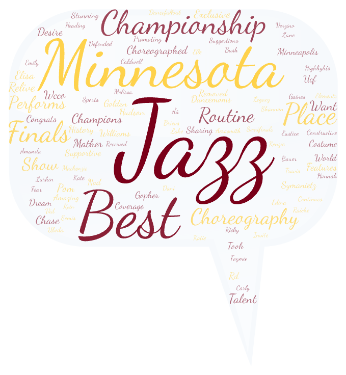
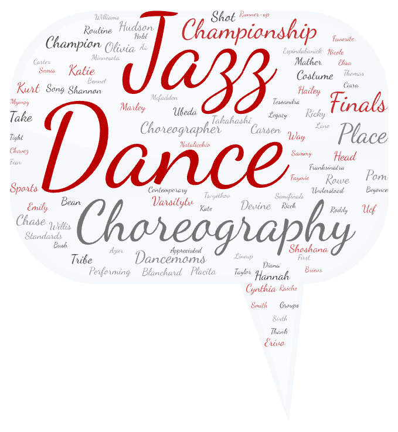

# UDA Comment Data and Discussion
*This is a submission for **Lab 2: Web data collection and visualization** in the UW Seattle GEOG 458 course taught by Professor Bo Zhao*

## Background
The Universal Dance Association (UDA) is a major organizer of dance camps, competitions, and more. For this project, we take a look at comments revolving around 2 of the top UDA College Nationals competitors: [**Minnesota Dance**](https://www.minnesotadanceteam.com/) and [**Ohio State Dance**](https://ohiostatebuckeyes.com/sports/2018/7/2/dance-team).

As the popularity of UDA Nationals continues to grow, extending its audience outside of the dance world, the comments made about teams and dancers begins to change. People who have spent their lives in dance are now discussing how increased popularity may shift comments to be more like those seen under NCAA recognized sports. This means an increase in critique and competitiveness among fans, in addition to expected increase in support. While this shift is just beginning, it's important to understand how it affects the overall community, as well as the dancers and teams who are presented for critique.

In order to get a good look at the current commentary, I am looking at Minnesota and Ohio State comments. These two teams have a reputation for being top scorers, specifically in the *Jazz* and *Pom* categories, making their routines some of the most widely viewed and most often discussed. Using data on these teams will *(1)* ensure we have a considerable amount of data, and *(2)* increase the diversity among the pool of commenters. 

## Process
### Data Collection
To collect data, I used a web crawler to extract the comment data on different YouTube videos. In order to make a good comparison, I kept the method as similar as possible, only changing the name of the school in the beginning url and search terms. Here are the specifics:

| | **Minnesota** | **Ohio State** |
| ----- | ----- | -----|
| **URL Source** | [https://www.youtube.com/results?search_query=minnesota+dance](https://www.youtube.com/results?search_query=minnesota+dance) | [https://www.youtube.com/results?search_query=ohio+state+dance](https://www.youtube.com/results?search_query=ohio+state+dance)|
| **Search Terms** | "minnesota", "university of minnesota", "minnesota dance", "minnesota jazz", "minnesota pom", "jazz", "pom" | "ohio state", "ohio state university", "ohio dance", "ohio state dance", "ohio jazz", "ohio state jazz", "ohio state pom", "ohio pom", "jazz", "pom"|

The crawler took all comments and created a csv file for each team. Once inputted into a word cloud generator, I went through all words, removing those that were common or meaningless alone. For example I deleted "wide", "world", and "sports", as they relate to the location in which they compete, and do not add to the comparison. I did choose to leave in names, even though they may not be meaningful without context. I think it is important to see that these comments include specific names. With that being said, this process inherently adds bias, and likely could produce different results if someone else made the deletions. 

### Files
The following are the csv files created by the crawler.

Click to download:
> <a href="assets/minnesota-search.csv" download>minnesota-search.csv</a>

> <a href="assets/ohio-search.csv" download>ohio-search.csv</a>

Header Key: 
- **video_url**: url to the searched video
- **user_url**: url of account that posted the video (this can be added on to the end of "youtube.com/" to find the account)
- **username**: username of the account that posted the video
- **title**: title of the YouTube video
- **view_num**: number of views on the YouTube video
- **created_at**: how long ago the video was posted
- **shortdesc**: the description included in each under the YouTube video, written by the account that posted the video
- **collected_at**: the time in which the data was collected

### Visualization

## Analysis
